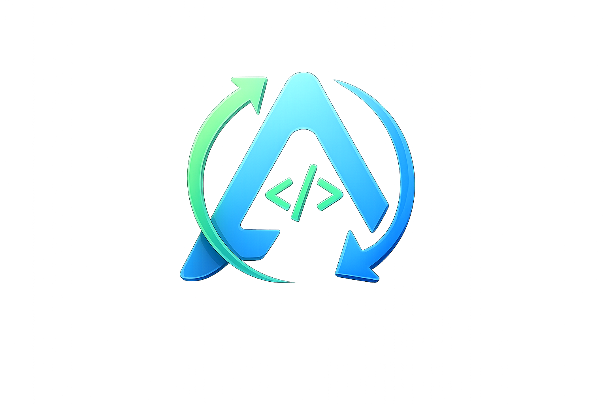

<div align="center">



# 🚀 AlgoSync

### Automatically sync and organize your coding solutions from **LeetCode** & **GeeksForGeeks** directly to GitHub.

A modern Chromium browser extension that automatically uploads your accepted coding solutions to GitHub with organized repositories, automatic README generation, and multi-solution support.


</div>

---

# 📦 Download

Download the latest release from GitHub:

### 👉 https://github.com/Aditya-0709/AlgoSync/releases/latest

---

# ✨ Features

- 🔄 Automatic GitHub Synchronization
- 🟢 LeetCode Support
- 🔵 GeeksForGeeks Support
- 📂 Organized Repository Structure
- 📝 Automatic README Generation
- 📚 Platform-wise README Files
- 🧠 Multi-Solution Upload

  - Brute Force
  - Better
  - Optimal
  - Custom

- 📄 Individual Problem README
- 📈 Progress Tracking
- 🔒 GitHub OAuth Authentication
- ⚡ Fast Synchronization
- 🧩 Modular Architecture
- 🌐 Chromium Browser Support

---

# 🌐 Supported Browsers

| Browser | Supported |
|----------|:---------:|
| Google Chrome | ✅ |
| Brave | ✅ |
| Microsoft Edge | ✅ |
| Opera | ✅ |
| Arc | ✅ |

> Firefox is no longer supported.

---

# 📸 Screenshots

> Add screenshots here.

```
assets/screenshots/

popup.png
repository.png
leetcode.png
gfg.png
```

---

# 📌 Supported Platforms

| Platform | Status |
|----------|:------:|
| LeetCode | ✅ |
| GeeksForGeeks | ✅ |

---

# 📁 Repository Structure

```
LeetCode/
└── 0001-two-sum/
    ├── README.md
    ├── BruteForce.java
    ├── Better.java
    ├── Optimal.java

GeeksForGeeks/
└── two-sum/
    ├── README.md
    ├── Solution.java
```

---

# 🚀 Installation (For Users)

## Step 1

Download the latest release.

https://github.com/Aditya-0709/AlgoSync/releases/latest

---

## Step 2

Extract the ZIP file.

---

## Step 3

Open

```
chrome://extensions
```

---

## Step 4

Enable **Developer Mode**

---

## Step 5

Click

```
Load unpacked
```

---

## Step 6

Select the extracted folder containing

```
manifest.json
```

That's it! 🎉

---

# 💻 Build From Source (For Developers)

Clone the repository

```bash
git clone https://github.com/Aditya-0709/AlgoSync.git
cd AlgoSync
```

Install dependencies

```bash
npm install
```

Build

```bash
npm run build
```

Run tests

```bash
npm test
```

Format

```bash
npm run format
```

Lint

```bash
npm run lint
```

---

# 🚀 Usage

1. Install AlgoSync
2. Login with GitHub
3. Select or create a repository
4. Solve a problem on LeetCode or GeeksForGeeks
5. Submit an Accepted solution

AlgoSync automatically uploads:

- ✅ Solution
- ✅ Problem README
- ✅ Platform README
- ✅ Repository README
- ✅ Commit to GitHub

---

# 🏗️ Project Architecture

```
scripts/
│
├── github/
├── parsers/
├── generators/
├── models/
├── services/
└── utils/
```

---

# 🛠 Tech Stack

- JavaScript
- HTML
- CSS
- Webpack
- Chrome Extension Manifest V3
- GitHub REST API

---

# 🤝 Contributing

Contributions are always welcome.

1. Fork the repository
2. Create a new branch

```bash
git checkout -b feature/my-feature
```

3. Commit your changes

```bash
git commit -m "Add new feature"
```

4. Push the branch

```bash
git push origin feature/my-feature
```

5. Open a Pull Request

---

# 🙏 Acknowledgements

AlgoSync was originally inspired by **LeetHub v2**.

The project has since been significantly redesigned and enhanced with:

- Modular Architecture
- GeeksForGeeks Support
- Multi-Solution Upload
- Automatic README Generation
- Improved Repository Organization
- Domain Models
- Service Layer
- GitHub Abstraction
- Chromium-only Support

Special thanks to the original LeetHub contributors for the inspiration.

---

# 📄 License

This project is licensed under the **MIT License**.

See the **LICENSE** file for more information.

---

<div align="center">

## ⭐ If AlgoSync helps you, consider giving this repository a Star!

Made with ❤️ by **Aditya Garg**

</div>